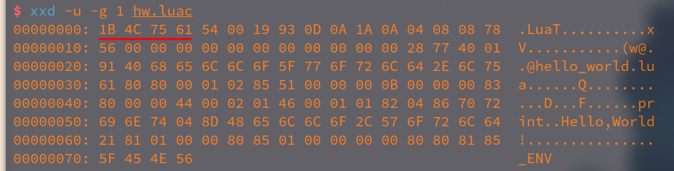

# go-lua
## 关于lua的编译器用go实现
本项目是跟学一本书：

《自己动手实现Lua：虚拟机、编译器和标准库》

作者：张秀宏

## 开始

> $LUAGO作为项目的根目录

> 我的在$HOME/go/src/go-lua/


## ch01

```shell
cd go/src/go-lua #这是我建立的
md go lua
md go/ch01/src/luago
edit go/ch01/src/luago/main.go
```

实现helloworld打印

> 编译 go install ./main.go </br>
> 运行 go run ./main.go

## ch01

Lua是一门脚本语言，为了达到较高的执行效率，内置了虚拟机。

并不是直接被Lua解释器执行，而是类似Java，先编译成字节码，再交给虚拟机执行。

Lua字节码需要一个载体，就是二进制chunk，其相当于Java的class文件。

```shell
cd $LUAGO/go/
cp -r ch01/ ch02
md ch02/src/luago/binchunk
export GOPATH=$PWD/ch02
md $LUAGO/lua/ch02
```


### 二进制chunk

#### luac
luac命令主要有两个用途：
1. 把Lua源文件编译成二进制chunk文件
2. 作为反编译器，分析二进制chunk，将信息输出到控制台。

java是javap用于反编译class文件

> luac可直接运行查看

```shell
luac hello_world.lua #生成luac.out
luac -o hw.luac hello_world.lua #生成hw.luac
luac -s hello_world.lua #不包含调试信息
luac -p hello_world.lua #只进行语法检查
```

Lua编译器已函数为单位进行编译，每一个函数都会被编译器编译为一个内部结构，叫作"原型"(Prototype)，其包含6部分:
1. basic info - 函数基本信息(包括参数数量、局部变量数量)
2. bytecodes - 字节码
3. constante - 常量表
4. upvaluse - Upvalue表
5. bug info - 调试信息
6. sub functions - 子函数原型列表

函数原型是一种递归结构，并且Lua源码中函数的嵌套关系会直接反映在编译后的原型里。


二进制chunk本质上也是一个字节流，不过class设计的相当紧凑。

1. 二进制chunk格式属于Lua虚拟机内部实现细节，并没有标准化，一切以官方实现的源代码为准。
2. 其设计没有考虑跨平台的需求，对于需要使用超过一个字节表示的数据，必须要考虑大小端问题。官方做法：编译Lua脚本时，直接按照本机的大小端方式 生成，当加载时，会探测被加载文件的大小端方式，如果和本机不匹配，就拒绝加载。
3. 没有考虑不同Lua版本之间的兼容问题，官方做法：编译脚本时，直接按照当时的Lua版本生成二进制，当加载时，检测加载文件的版本号，不匹配，拒绝加载。
4. 设计的不紧凑，在某些情况下，编译后的会比文本形式的源文件还大。但我们的目的是为了获得更快的加载速度，所以不是大问题。

Lua原本是用C实现的，本书使用Go语言

Lua的类型大致分为三种：
1. 数字
- 字节 存放一些比较小的整数值：版本号、函数参数个数等
- C语言整型（cint）列表长度
- C语言size_t(size_t) 长字符串长度
- Lua 整数 常量表中出现
- Lua 浮点数 常量表中出现

| 数据类型        | C 语言类型             | GO语言类型 | 占用字节 |
|-----------------|------------------------|------------|----------|
| 字节            | lu_Byte(unsigned char) | byte       | 1        |
| C语言整型       | int                    | uint32     | 4        |
| C语言size_t类型 | slize_t                | uint64     | 8        |
| Lua整型         | lua_Integer(long long) | int64      | 8        |
| Lua浮点型       | lua_Number (double)    | float64    | 8        |

2. 字符串
- 就是一个字节数组。因为其长度不固定，需要把字节数组的长度也记录到二进制chunk中。
- 作为优化，可进一步分为短字符和长字符，具体分三种:

| 情况                                | 优化                                                         |
|-------------------------------------|--------------------------------------------------------------|
| 对于NULL字符                        | 只用0x00表示                                                 |
| 对于长度小于等于253（0xFD）的字符串 | 先使用一个字节记录长度+1，然后是字节数组                     |
| 对于长度大于等于254（0xFE)的字符串  | 第一个字节是0xFF，后面跟一个size_t记录长度+1，最后是字节数组 |


1. 列表
- 指令表、常量表、子函数原型表等信息都是按照列表的方式存储。
- 先用一个cint类型记录列表长度，然后紧接存储n个列表元素

总体结构：

分为头部和主函数原型

头部总共占用30个字节（因平台而异）包含：
- 签名
- 版本号
- 格式号
- 各种整数类型占用的字节数
- 大小端
- 浮点数格式识别信息等


### 各个字段含义

#### 签名

很多二进制格式都会以固定的魔数开始，比如java的class文件，是以四字节的0xCAFEBABE。
Lua也是四字节分别是ESC、L、u、a的ASCII码，表示为0x1B4C7561，写出GO的字面量为："\x1bLua"

主要用于快速识别文件格式的作用。
> xxd -u -g 1 hello_world.luac #可查看




#### 版本号

签名后的一个字节，记录其所对应的Lua版本号，由三部分构成：
- 大版本号（Major Version）
- 小版本号（Minor Version）
- 发布号（Release Version）

> 当前为5.4.4 即大版本5，小版本4，发布号4.

二进制中存放的版本号是根据Lua大小版本号算出来的，值等于大版本号乘以16加小版本号，之所以没有考虑发布号是因为其意味bug修复。

#### 格式号
之后的一个字节记录二进制chunk格式号。官方实现使用的格式是00

#### LUAC_DATA

格式号之后的6个字节在官方实现里叫作LUAC_DATA。其中前两个字节：0x1993 这是Lua1.0发布的年份
后四个依次为：回车符(0x0D)、换行符(0x0A)、替换符(0x1A)和另一个换行符

> 写出Go语言字面量为："\x19\x93\r\n\x1a\n"

主要起进一步校验的作用。若在加载时发现和预期不一致，则认为文件已经损坏，拒绝加载。

#### 整数和Lua虚拟指令宽度

接下来的5个字节分别记录cint、size_t、Lua虚拟机指令、Lua整数、Lua浮点数这5种数据类型在二进制里占用的字节数。

在加载时会检查这5种，和期望不一致则拒绝加载。

#### LUAC_INT
接下来的n个字节存放Lua整数值0x5678，在机器上占用多少字节，n就等于多少

目的是为了检测大小端方式，利用这个数据检查其大小端方式是否和本机匹配。

#### LUAC_NUM

头部的最后n个字节存放Lua浮点数370.5。n同上。

目的是为了检测其所使用的浮点数格式。目前主流的平台和语言一般采用IEEE754浮点数格式。
